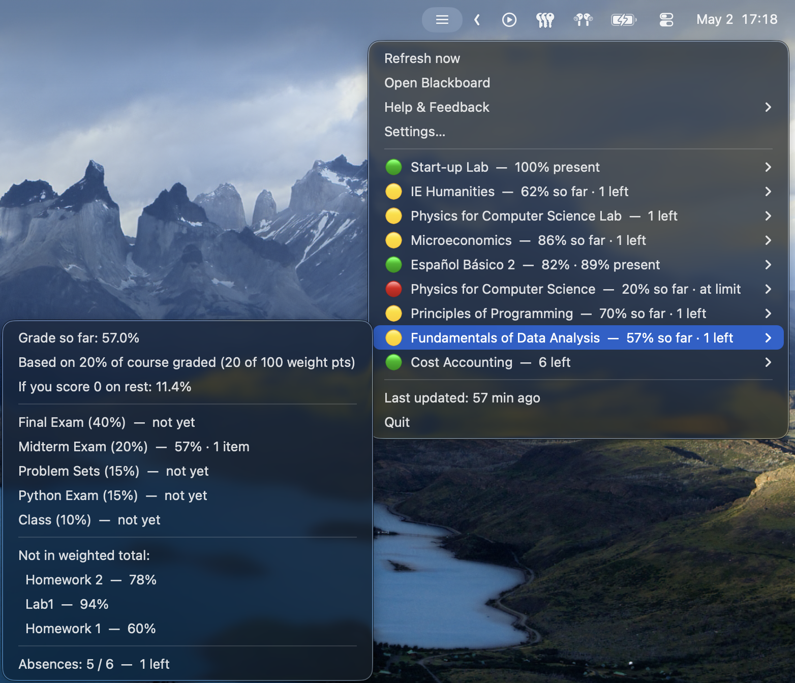
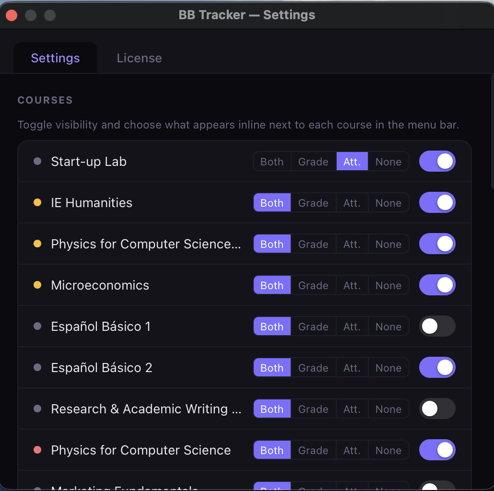
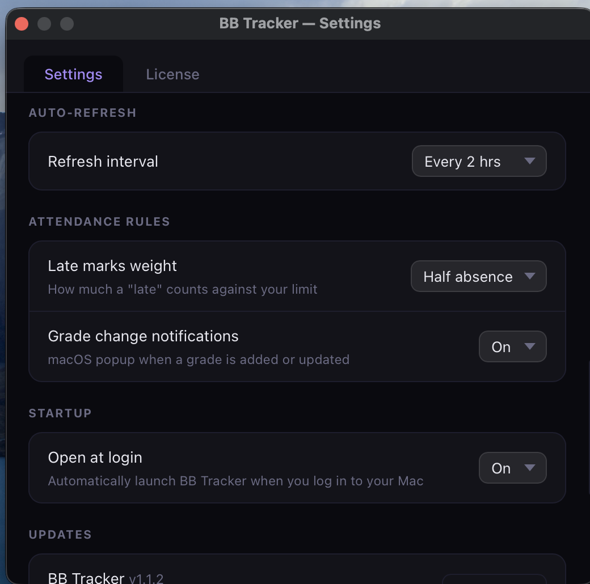
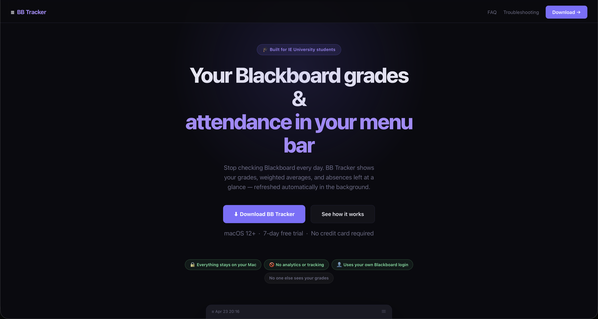

# BB Tracker

**Your Blackboard grades and attendance, live in your macOS menu bar.**

A native menu bar app for IE University students that scrapes Blackboard Ultra in the background and shows live grades, weighted averages, and remaining absences at a glance — no more refreshing Blackboard every day.

[**Download for macOS →**](https://bblivetracker.netlify.app)
&nbsp;·&nbsp;
[Website](https://bblivetracker.netlify.app)
&nbsp;·&nbsp;
7-day free trial · No credit card required

> Solo project, shipped end-to-end as a paid macOS product (~5,700 lines of Python). This repository is a public showcase — see [*A note on the source code*](#a-note-on-the-source-code) at the bottom.

---

## Screenshots

   
  <em>Status indicator in the menu bar, per-course list with traffic-light status, and a per-course submenu showing the live weighted grade with assessment-by-assessment breakdown.</em>

   
  <em>Settings: per-course visibility and inline-display toggles. Built with WebKit, embedded in a native Cocoa window.</em>

   
  <em>Settings: refresh interval, late-marks weight (matching IE's "late = half absence" policy), grade-change notification toggle.</em>

   
  <em>Marketing site — <a href="https://bblivetracker.netlify.app">bblivetracker.netlify.app</a>.</em>

---

## What it does

BB Tracker lives in your menu bar and shows a single status icon summarizing how close you are to the 80% attendance limit across all your courses:

| Indicator | Meaning |
|---|---|
| 🟢 | All good |
| 🟡 | At least one course at ≤2 absences remaining |
| 🔴 | At or over the limit |
| 🔑 | Microsoft session expired — click to re-login |

Click the icon and you get a per-course dropdown with `absent / max · remaining` and your current weighted grade. The app re-scrapes Blackboard automatically in the background (default every 2 hours) and fires a native macOS notification the moment a grade is posted or changes.

---

## Features

- **Weighted grade calculation.** Auto-parses each course's syllabus PDF to extract assessment categories and weights, then computes the real weighted grade — not a flat average.
- **Attendance engine.** Enforces IE's 80% rule with a configurable `max_absence_pct` and a configurable `late_absence_weight` (default 0.5, matching IE's policy that a late counts as half an absence).
- **Grade scraping.** Pulls grades both via Blackboard's internal grade API (intercepted from the Playwright network layer) and a text-parsing fallback, with deduplication.
- **Grade-change notifications.** Diffs each scrape against the previous one; sends a native macOS notification when a grade is posted or changes.
- **Auto-refresh** in the background on a configurable interval, with single-instance locking.
- **Course filters.** Hide courses you don't want to track, or show only Blackboard "favorites".
- **Settings window.** Full HTML/CSS/JS UI rendered with WebKit inside a native Cocoa window, with a JS↔Python message bridge for live config edits and "Sync now".
- **First-run onboarding.** Full-screen WebKit window that walks new users through Microsoft SSO + Authenticator login, handles browser install progress, and self-heals if interrupted.
- **In-app auto-updater.** Checks the marketing site for new versions, downloads the new `.dmg` with a live progress window (progress bar, "X MB of Y MB", cancel button), and replaces the installed `.app` bundle in place.
- **Login-item registration** for auto-start at login.

---

## How it works (the interesting parts)

**Authentication against Microsoft SSO.** The hard part of any Blackboard scraper is getting past Microsoft's MFA + Authenticator flow. BB Tracker uses Playwright with a persistent Chromium profile, so the user logs in once interactively and the cookies survive between Microsoft's 30–90 day session-token rotations. When the session does expire, the app detects it and surfaces a 🔑 prompt in the menu bar to re-login.

**Syllabus-driven grade weighting.** Most attendance/grade trackers either ignore weighting or make the user enter it manually. BB Tracker downloads each course's syllabus PDF, parses it with `pdfplumber`, and uses keyword normalization (singularization + synonyms) to map syllabus categories to gradebook categories. There's a bundled-weights fallback for known courses when the syllabus can't be parsed.

**WebKit + Cocoa GUI inside a Python menu bar app.** The Settings, onboarding, and pricing windows are full HTML/CSS/JS pages rendered in `WKWebView`, embedded in native `NSWindow`s via PyObjC, with `WKScriptMessageHandler` bridging JS calls back to Python. This keeps the UI flexible (it's just a webpage) while still feeling native.

**Anti-tamper trial system without a backend.** The 7-day trial start is signed and stored in two locations — a config file *and* an `NSUserDefaults` anchor. The app always trusts the **earliest** of the two, so deleting the config file doesn't reset the trial clock. Paid licenses are validated online against the Lemon Squeezy API, with a grace-period state for offline use.

**Custom URL scheme deep-linking.** The activation page on the marketing site links to `bbtracker://activate?key=...`, which is handled by the running app via Cocoa's `NSAppleEventManager`. One click on the website activates the license inside the app — no copy-paste.

**Self-updating native app.** The auto-updater downloads the new `.dmg` with a cancel-able progress UI, mounts it, and replaces the installed `.app` bundle in place — including the running binary, with a relaunch handoff.

---

## Tech stack

- **Python 3.12**
- **Playwright** (headless Chromium) for Blackboard scraping
- **rumps** for the menu bar shell
- **PyObjC** (Cocoa, WebKit, Foundation) for native windows and the JS↔Python bridge
- **pdfplumber** for syllabus PDF parsing
- **PyInstaller** for `.app` packaging, distributed as a signed `.dmg`
- **launchd** for auto-start
- **Lemon Squeezy** for payments + license API
- **Netlify** for the marketing + activation site (hand-rolled HTML/CSS)

---

## Project scope

- **~5,700 lines of Python** across ~10 modules (`menubar.py`, `scraper.py`, `settings_window.py`, `license.py`, `updater.py`, …).
- **Solo project, end-to-end.** Code, packaging, signing, the marketing site, payments integration, customer support.
- **Shipping product** with paying users (free trial → monthly / yearly / lifetime tiers).
- Active development — versioned releases delivered to users via the in-app updater.

---

## Download

Grab the latest `.dmg` from **[bblivetracker.netlify.app](https://bblivetracker.netlify.app)**.

Requires macOS 12+. 7-day free trial, no credit card required.

---

## A note on the source code

BB Tracker is a commercial product, so the source code is **proprietary and not included in this repository**. This repo exists as a public-facing description of the project for portfolio purposes.

If you're a recruiter or engineer interested in seeing specific parts of the implementation — happy to walk through code in an interview. Reach me at **kai@kempe-family.de**.

---

BB Tracker is an independent project and is not affiliated with, endorsed by, or sponsored by IE University or Anthology Inc. (Blackboard). All product names, logos, and trademarks are the property of their respective owners.
