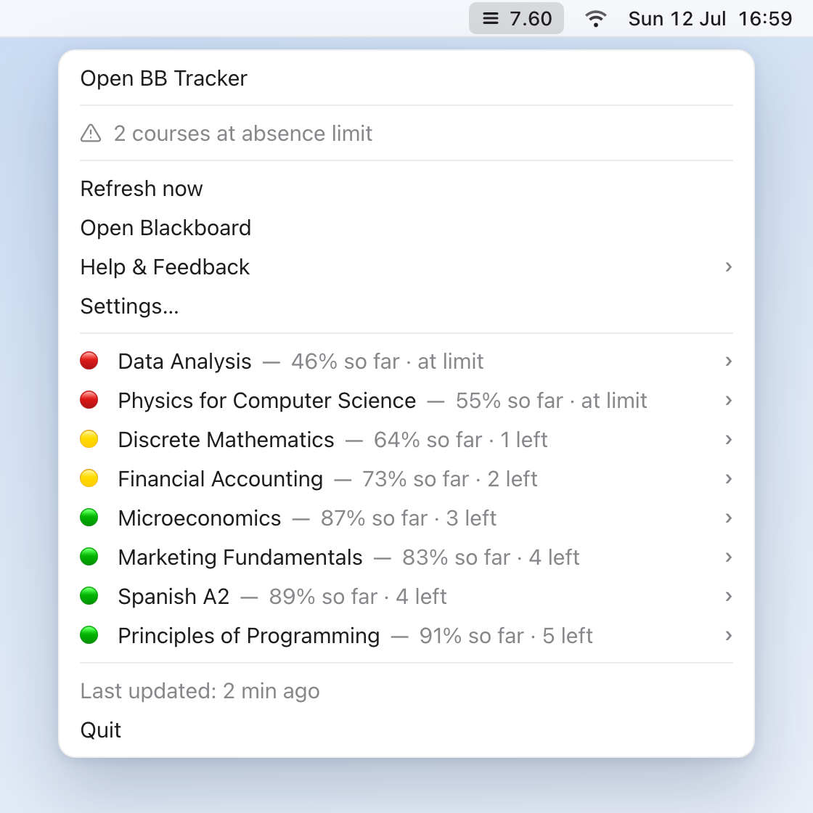
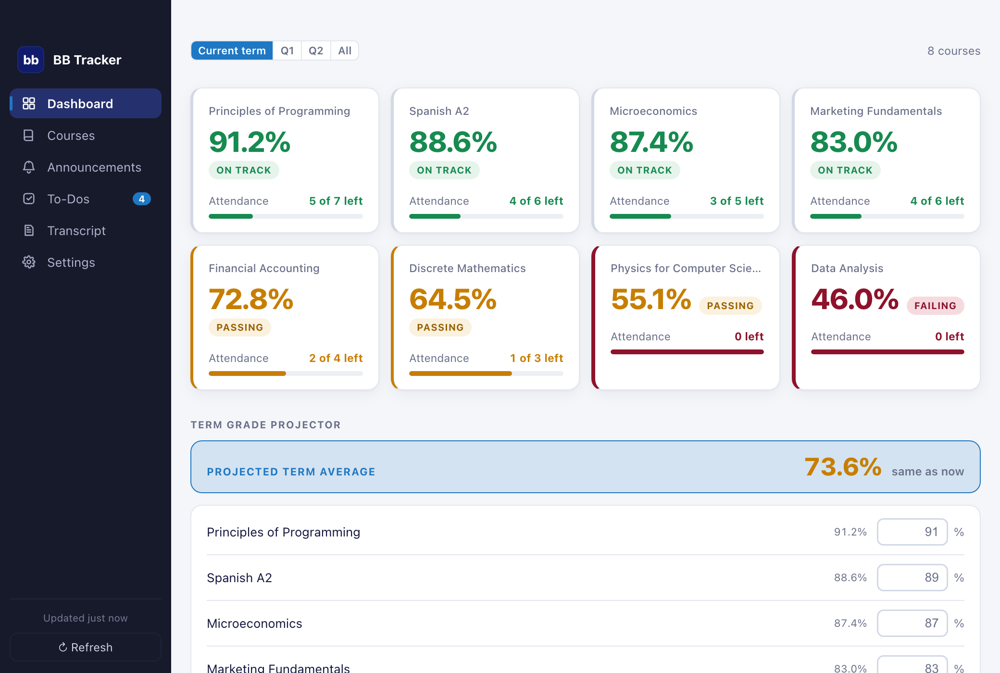
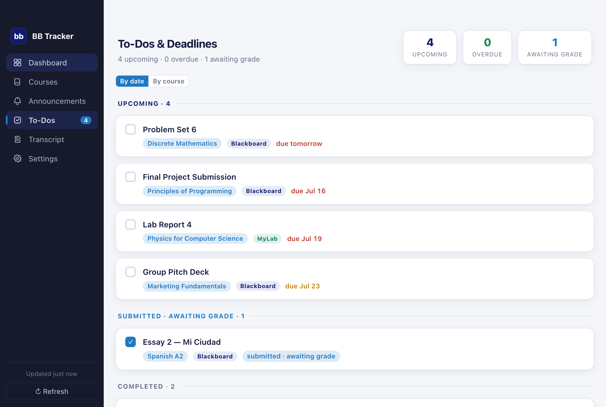
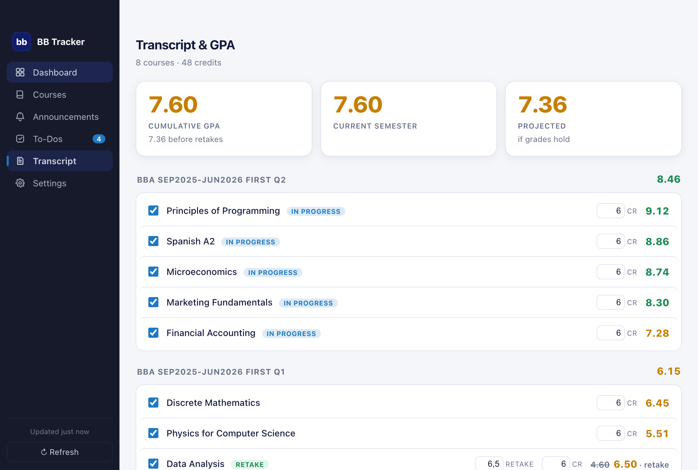

  
  <h1>BB Tracker</h1>
  
<strong>Blackboard, in your menu bar.</strong>

  
Every grade, every absence, every deadline, and your GPA — without opening Blackboard.

  

    <a href="https://bblivetracker.netlify.app">Download</a>
    &nbsp;·&nbsp;
    <a href="#how-it-works">How it works</a>
    &nbsp;·&nbsp;
    <a href="#privacy">Privacy</a>
  

---

## At a glance

<picture>
  <source media="(prefers-color-scheme: dark)" srcset="screenshots/menubar-dark.png">
  
</picture>

A small indicator lives in your menu bar — your GPA can sit right next to the clock. Open it to see every course with the grade you have so far and how many absences you have left before the 20% cap kicks in, riskiest course first.

## What it does

- **Attendance, computed.** Pulls your present / late / absent counts from Blackboard Ultra and shows how many absences you can still take per course before crossing the 80% rule.
- **Grades that match your transcript.** Shows Blackboard's own calculated course total — the number that ends up on your transcript — with syllabus-weighted math as a fallback.
- **A real GPA.** The same math the registrar uses: language and lab courses left out, retakes replace fails, credits weight each course.
- **What-if projector.** Type a score for the final and watch your course grade move — or ask what you need to pass.
- **Deadlines that tick themselves off.** Every due date from Blackboard and Pearson MyLab in one To-Dos list. Click one and you land on the assignment itself.
- **Pearson MyLab integration.** Course uses Pearson? Those assignments and scores show up next to your Blackboard ones.
- **Announcements with notifications.** A new announcement marked *"deadline"*, *"exam"*, or *"mandatory"* triggers a macOS notification — the rest stay quiet.
- **Automatic.** Refreshes every two hours in the background. No tabs to keep open.

## Screenshots

**Dashboard** — every course, its attendance budget, and a term grade projector:

<picture>
  <source media="(prefers-color-scheme: dark)" srcset="screenshots/dashboard-dark.png">
  
</picture>

**To-Dos** — every deadline from Blackboard and Pearson in one list:

<picture>
  <source media="(prefers-color-scheme: dark)" srcset="screenshots/todos-dark.png">
  
</picture>

**Transcript** — GPA computed the way the registrar computes it:

<picture>
  <source media="(prefers-color-scheme: dark)" srcset="screenshots/transcript-dark.png">
  
</picture>

The app follows your system appearance — every screen has a light and a dark version.

## How it works

You log in with your IE Microsoft account once. BB Tracker keeps that login session and uses it to sync your own course data directly from Blackboard's API in the background — no bundled browser, no servers in between. Everything stays on your Mac.

When a sync finishes, the result lives in `~/Library/Application Support/BBTracker/` as plain JSON. The menu bar and dashboard read from that.

## Privacy

- **Local-only.** Your Blackboard cookies, grades, and attendance never leave your Mac.
- **No analytics.** No telemetry, no crash uploads.
- **License check.** The only network call BB Tracker makes outside your own Blackboard and Pearson accounts is a weekly license-status ping to Lemon Squeezy — nothing more.

## Pricing

7-day free trial, no card needed. Then a small one-time / yearly fee — see the [download page](https://bblivetracker.netlify.app) for current pricing.

## System requirements

- macOS 12 (Monterey) or later — Apple Silicon or Intel
- An IE University Blackboard account

## Support

Questions, bugs, feature requests → [bblivetracker@gmail.com](mailto:bblivetracker@gmail.com)

---

BB Tracker is an independent project and is not affiliated with, endorsed by, or sponsored by IE University or Blackboard Inc. *Blackboard* is a trademark of Blackboard Inc. *IE University* is a trademark of IE University.

Source code is proprietary — this repository hosts the public landing material only.
