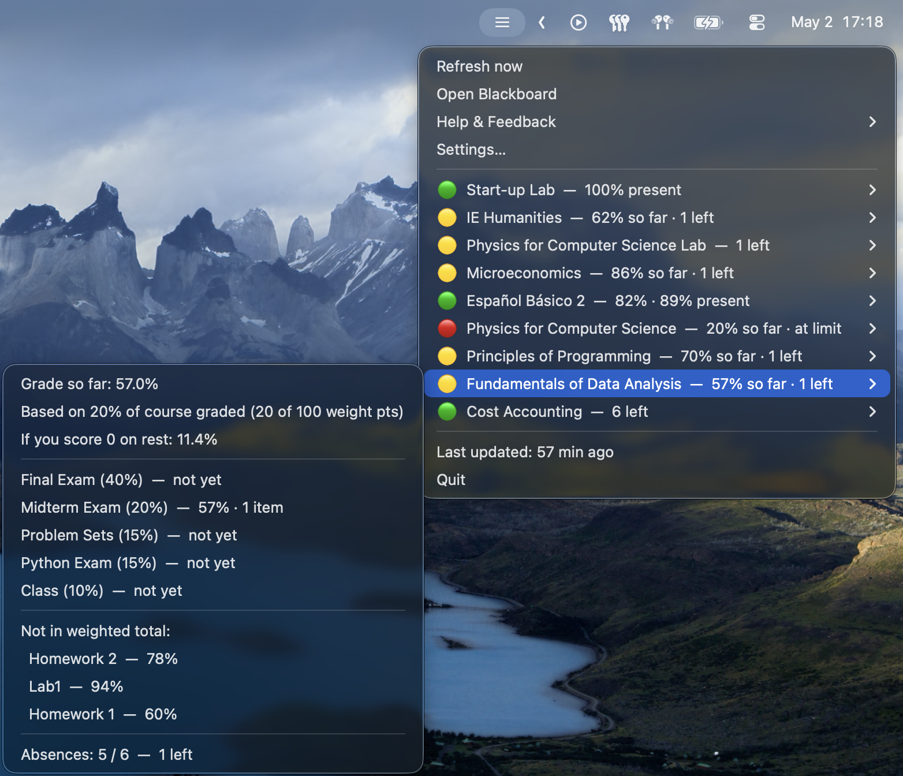
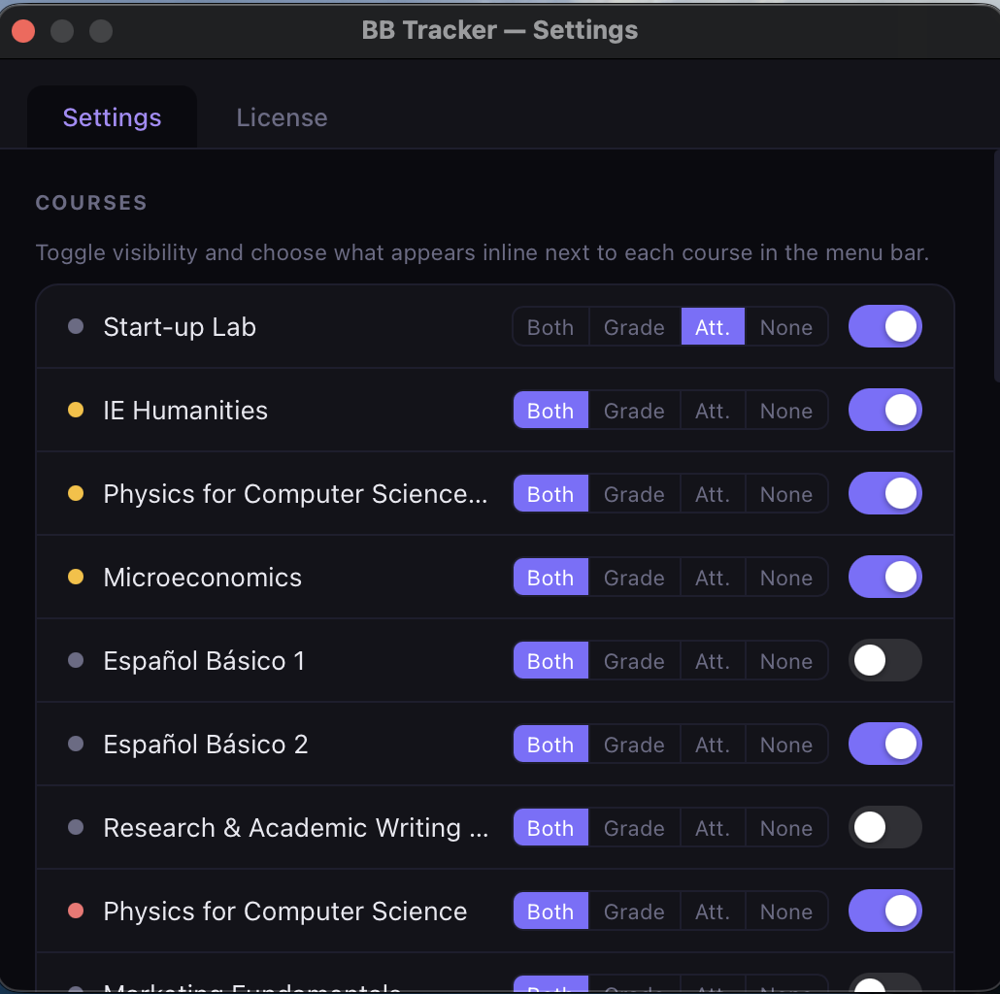
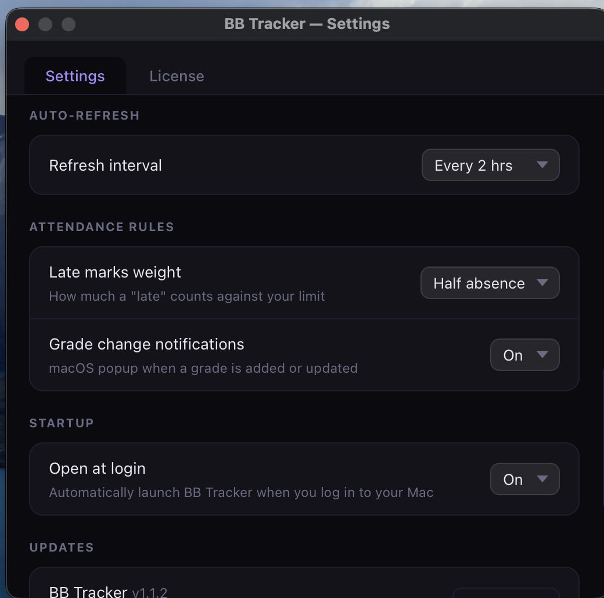
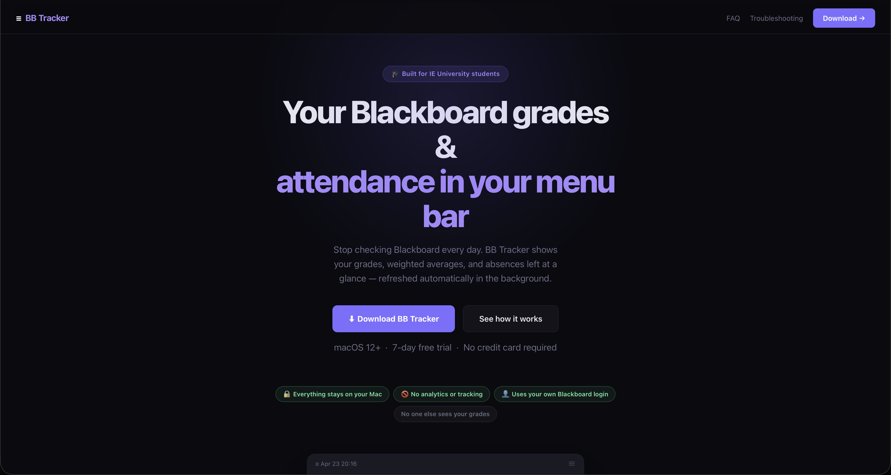

  
  <h1>BB Tracker</h1>
  
<strong>Blackboard, in your menu bar.</strong>

  
See your IE University grades and remaining absences at a glance — without opening Blackboard.

  

    <a href="https://bblivetracker.netlify.app">Download</a>
    &nbsp;·&nbsp;
    <a href="#how-it-works">How it works</a>
    &nbsp;·&nbsp;
    <a href="#privacy">Privacy</a>
  

---

## At a glance

A small indicator lives in your menu bar. Open it to see every course with the grade you have so far, how many absences you've used, and how many you have left before the 20% cap kicks in.

## What it does

- **Attendance, computed.** Pulls your present / late / absent counts from Blackboard Ultra and shows how many absences you can still take per course before crossing the 80% rule.
- **Weighted grades.** Reads each syllabus, parses the grading weights, and shows what you have so far — even when Blackboard only shows a flat overall.
- **MyLab / Pearson integration.** Course uses Pearson? Those assignments show up next to your Blackboard ones in one place.
- **Announcements with notifications.** New announcement marked *"deadline"*, *"exam"*, or *"mandatory"* triggers a macOS notification — the rest stay quiet.
- **Automatic.** Refreshes every two hours in the background. No tabs to keep open.

## Screenshots

<table>
  <tr>
    <td width="50%"></td>
    <td width="50%"></td>
  </tr>
  <tr>
    <td colspan="2"></td>
  </tr>
</table>

## How it works

You log in to your IE Microsoft account once. BB Tracker keeps a saved browser session (the same way Safari or Chrome would) and uses it to read your own course data in the background. Everything stays on your Mac — nothing about your grades, attendance, or login leaves your machine.

When a scrape finishes, the result lives in `~/Library/Application Support/BBTracker/` as plain JSON. The menu bar reads from that.

## Privacy

- **Local-only.** Your Blackboard cookies, grades, and attendance never leave your Mac.
- **No analytics.** No telemetry, no crash uploads.
- **License check.** The only network call BB Tracker makes outside your own Blackboard is a weekly license-status ping to Lemon Squeezy — nothing more.

## Pricing

7-day free trial. Then a small one-time / yearly fee — see the [download page](https://bblivetracker.netlify.app) for current pricing.

## System requirements

- macOS 12 (Monterey) or later — Apple Silicon or Intel
- An IE University Blackboard account

## Support

Questions, bugs, feature requests → [bblivetracker@gmail.com](mailto:bblivetracker@gmail.com)

---

BB Tracker is an independent project and is not affiliated with, endorsed by, or sponsored by IE University or Blackboard Inc. *Blackboard* is a trademark of Blackboard Inc. *IE University* is a trademark of IE University.

Source code is proprietary — this repository hosts the public landing material only.
