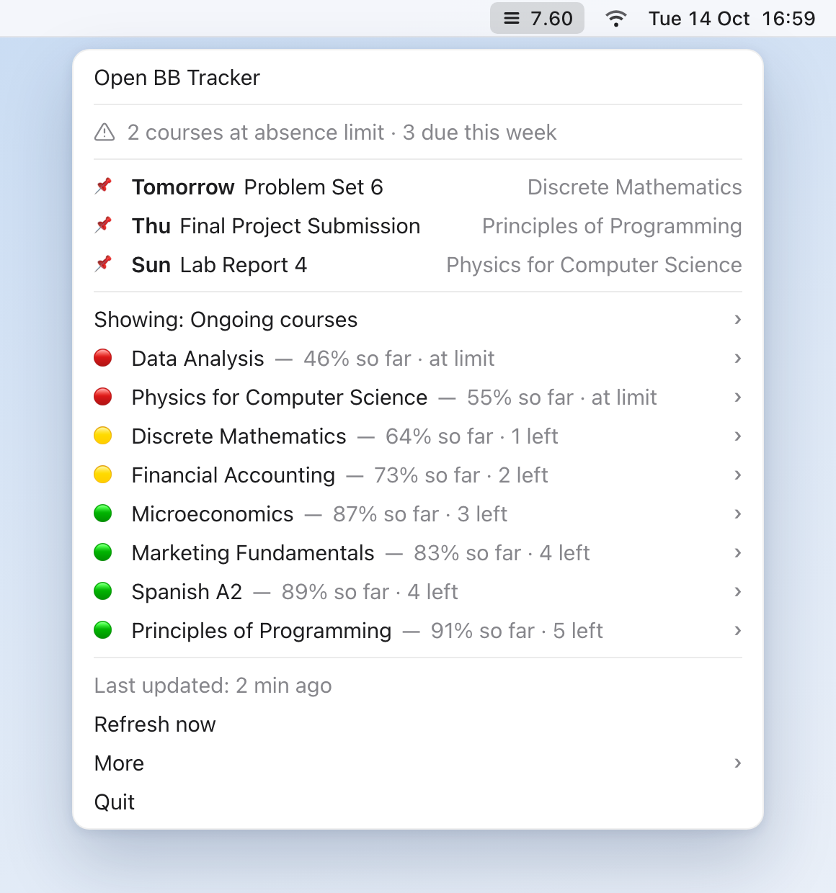
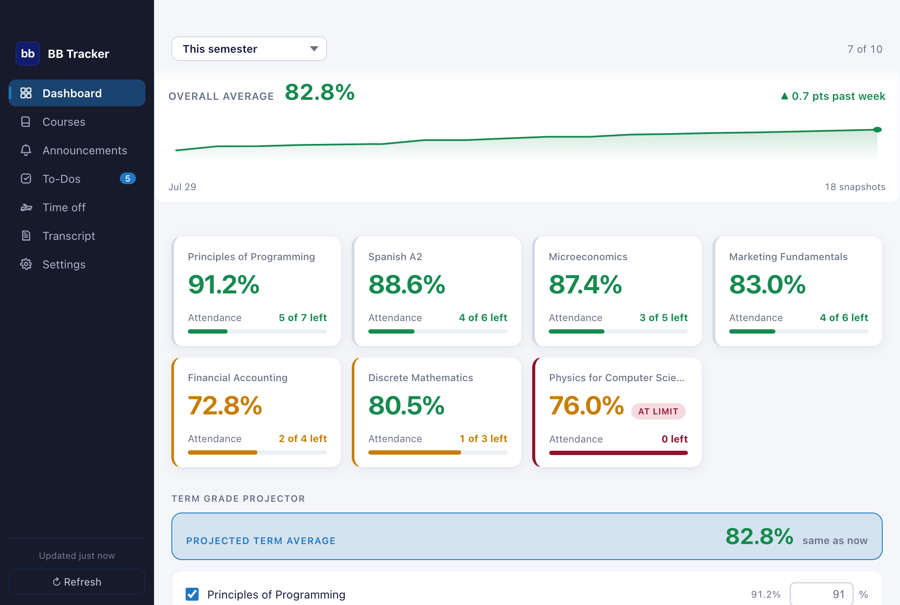
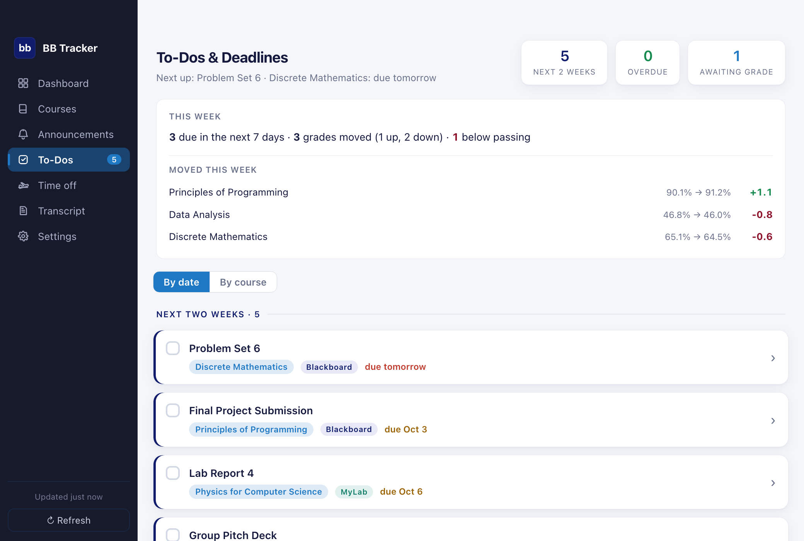
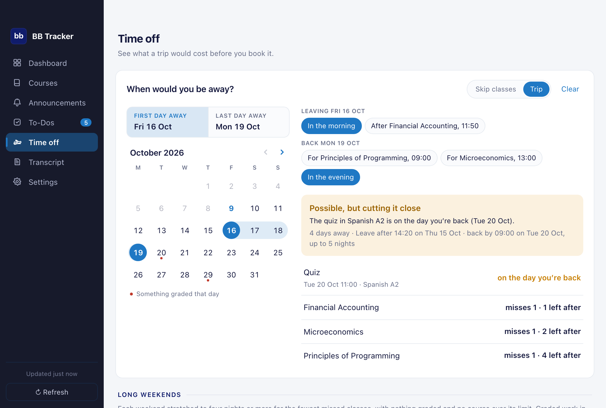
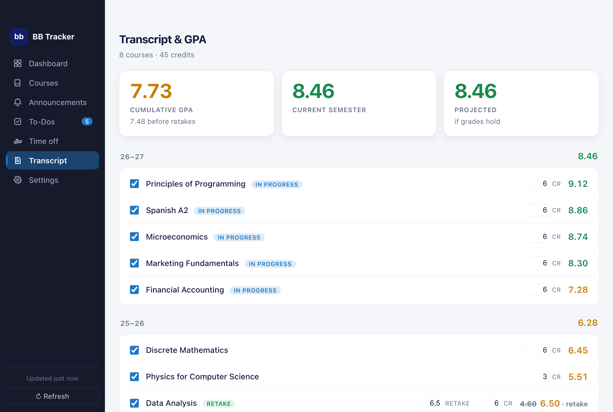

  
  <h1>BB Tracker</h1>
  
<strong>Blackboard, in your Mac's menu bar or your Windows taskbar.</strong>

  
Grades, absences, deadlines and your GPA, without ever opening Blackboard.

  

    <a href="https://bblivetracker.netlify.app">Download</a>
    &nbsp;·&nbsp;
    <a href="#how-it-works">How it works</a>
    &nbsp;·&nbsp;
    <a href="#privacy">Privacy</a>
  

---

## Why I built this

I got tired of logging into Blackboard five times a day just to check if I could afford to skip one more class. So I built a little menu bar app for myself that kept track of it. Then classmates saw it on my screen and started asking where they could get it.

That's when it turned into a real project. I've been building it out ever since: proper grade tracking, a GPA that actually matches the transcript, deadlines, exam dates, Pearson MyLab, all of it. It's out, it's in use, and I'm still the one who opens it first thing every morning.

## At a glance

<picture>
  <source media="(prefers-color-scheme: dark)" srcset="screenshots/menubar-dark.png">
  
</picture>

A small indicator lives in your menu bar on a Mac, or by the clock on Windows (your GPA can sit right next to it). Open it and you see every course with the grade you have so far and how many absences you have left before your program's limit, riskiest course first.

## What it does

- **Attendance, computed.** It pulls your present / late / absent counts from Blackboard and tells you exactly how many classes you can still miss per course before crossing your program's absence limit (20% by default, adjustable from 10% to 30%). No more counting on your fingers.
- **Grades that match your transcript.** It shows Blackboard's own calculated course total, the same number that ends up on your transcript. If a course doesn't have one, it parses the syllabus weights and does the math itself.
- **A real GPA.** Computed the way the registrar computes it: every graded course counts, weighted by the credits in its syllabus, and a retake replaces the fail. Only pass/fail and zero-credit courses stay out.
- **What-if projector.** Type a score for the final and watch your course grade move. Or flip it around and ask what you need to pass. It projects the whole term at once, and you can mark the quiz your professor drops so it stops dragging the number down.
- **Every deadline in one list.** Blackboard and Pearson MyLab due dates together in one To-Dos view. Click one and you land on the actual assignment.
- **Exams too, which Blackboard never lists.** There is no gradebook column for a midterm, a quiz or a presentation, so the highest-stakes dates of the term were the ones nothing could see. BB Tracker reads which session your syllabus calls graded and takes that session's date and room from your timetable.
- **Plan time off.** Pick the days you'd be away and see which classes you'd miss, how many absences each course has left after, and whether a midterm or quiz sits inside the trip or the day you're back. Or pick a suggested long weekend that costs you the fewest classes.
- **Group work, handled.** A teammate submitted for the group? Mark it done straight from the menu bar and the reminders stop.
- **In your calendar.** Every deadline and exam in a calendar of its own, tied to your IE Outlook account. Each sync keeps it right: a due date that moves updates in place instead of leaving yesterday's copy behind.
- **It notices when the syllabus changes.** A professor can reweight the grading mid-term and tell nobody. BB Tracker re-reads each syllabus, says what moved, and works your projected grade out against the new one.
- **Pearson MyLab built in.** If a course runs on Pearson, those assignments and scores show up next to your Blackboard ones.
- **Announcements that know when to bother you.** A new announcement mentioning a deadline, exam or something mandatory triggers a notification. The rest stay quiet.
- **A Monday digest.** One notification at the start of the week: your average, what's due, and any course below passing.
- **Fully automatic.** It refreshes every two hours in the background and updates itself. No tabs to keep open, nothing to maintain.

## Screenshots

**Dashboard.** Every course, its attendance budget, and a term grade projector:

<picture>
  <source media="(prefers-color-scheme: dark)" srcset="screenshots/dashboard-dark.png">
  
</picture>

**To-Dos.** Every deadline from Blackboard and Pearson in one list, exams included:

<picture>
  <source media="(prefers-color-scheme: dark)" srcset="screenshots/todos-dark.png">
  
</picture>

**Time off.** Pick the days, see what the trip costs:

<picture>
  <source media="(prefers-color-scheme: dark)" srcset="screenshots/timeoff-dark.png">
  
</picture>

**Transcript.** Your GPA, computed the way the registrar computes it:

<picture>
  <source media="(prefers-color-scheme: dark)" srcset="screenshots/transcript-dark.png">
  
</picture>

The app follows your system appearance. Every screen has a light and a dark version.

## How it works

You log in with your IE Microsoft account once. BB Tracker keeps that login session and uses it to sync your own course data straight from Blackboard's API in the background. No servers in between, everything stays on your computer.

When a sync finishes, the result lives in `~/Library/Application Support/BBTracker/` (`%APPDATA%\BBTracker` on Windows) as plain JSON, and the menu bar and dashboard read from that.

## Privacy

I built this for myself first, so it works the way I'd want any app to work with my own grades:

- **Local-only.** Your Blackboard cookies, grades and attendance never leave your computer.
- **No analytics.** No third-party SDKs, nothing tracking you. Crash reporting exists, but it is off unless you switch it on during setup, and what it sends carries no grades and no course names.
- **What it connects to.** Your own Blackboard and Pearson accounts, and the download page, to ask whether there's a newer version. The first time it needs them, it also downloads a small Node runtime (pypi.org) and a private browser (cdn.playwright.dev), and sends nothing to either. That's the full list.
- **What gets counted.** Update checks, website visits and download clicks are added up into daily totals, so I can tell whether anyone uses the app. No IP address, no device details, no identifier: only how many, never who.

## Price

Free. No trial, no card, no account. If a price ever comes back it won't apply to installs from before then.

## System requirements

- **Mac:** macOS 12 (Monterey) or later on an Apple Silicon Mac (M1 or later). Intel Macs aren't supported yet
- **Windows:** Windows 10 or 11 (64-bit). The installer needs no admin rights; it isn't signed yet, so Windows may show a "protected your PC" box once (More info, then Run anyway)
- An IE University Blackboard account

## Support

Questions, bugs, feature requests: [bblivetracker@gmail.com](mailto:bblivetracker@gmail.com). I read everything.

---

BB Tracker is an independent project and is not affiliated with, endorsed by, or sponsored by IE University or Blackboard Inc. *Blackboard* is a trademark of Blackboard Inc. *IE University* is a trademark of IE University.

Source code is proprietary. This repository hosts the public landing material only.
